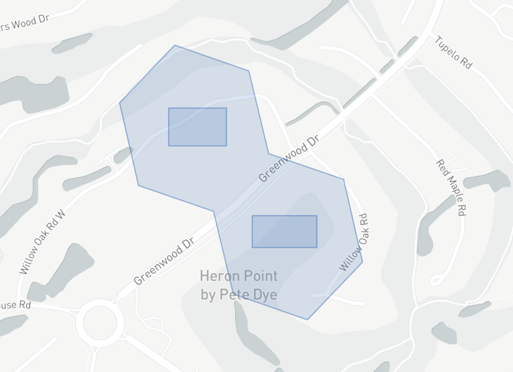

# **h3-pyspark**: Uber's H3 Hexagonal Hierarchical Geospatial Indexing System in PySpark

[](https://badge.fury.io/py/h3-pyspark)
[](https://anaconda.org/conda-forge/h3-pyspark)
[](https://github.com/kevinschaich/h3-pyspark/blob/master/LICENSE)

[](https://github.com/kevinschaich/h3-pyspark/actions/workflows/tests.yml)

PySpark bindings for the [H3 core library](https://h3geo.org/).

For available functions, please see the vanilla Python binding documentation at:

- [uber.github.io/h3-py](https://uber.github.io/h3-py)

## Installation

From `PyPI`:

```console
pip install h3-pyspark
```

From `conda`

```console
conda config --add channels conda-forge
conda install h3-pyspark
```

## Usage

```python
>>> from pyspark.sql import SparkSession, functions as F
>>> import h3_pyspark
>>>
>>> spark = SparkSession.builder.getOrCreate()
>>> df = spark.createDataFrame([{"lat": 37.769377, "lng": -122.388903, 'resolution': 9}])
>>>
>>> df = df.withColumn('h3_9', h3_pyspark.geo_to_h3('lat', 'lng', 'resolution'))
>>> df.show()

+---------+-----------+----------+---------------+
|      lat|        lng|resolution|           h3_9|
+---------+-----------+----------+---------------+
|37.769377|-122.388903|         9|89283082e73ffff|
+---------+-----------+----------+---------------+
```

## Extension Functions

There are also various extension functions available for geospatial common operations which are not available in the vanilla H3 library.

**Assumptions**

* You use GeoJSON to represent geometries in your PySpark pipeline (as opposed to WKT)
* Geometries are stored in a GeoJSON `string` within a column (such as `geometry`) in your PySpark dataset
* Individual H3 cells are stored as a `string` column (such as `h3_9`)
* Sets of H3 cells are stored in an `array(string)` column (such as `h3_9`)

### Indexing

#### index_shape(geometry: Column, resolution: Column)

Generate an H3 spatial index for an input GeoJSON geometry column.

This function accepts GeoJSON `Point`, `LineString`, `Polygon`, `MultiPoint`, `MultiLineString`, and `MultiPolygon`
input features, and returns the set of H3 cells at the specified resolution which completely cover them
(could be more than one cell for a substantially large geometry and substantially granular resolution).

The schema of the output type will be `T.ArrayType(T.StringType())`, where each value in the array is an H3 cell.

This spatial index can then be used for bucketing, clustering, and joins in Spark via an `explode()` operation.

```python
>>> from pyspark.sql import SparkSession, functions as F
>>> from h3_pyspark.indexing import index_shape
>>> spark = SparkSession.builder.getOrCreate()
>>>
>>> df = spark.createDataFrame([{
        'geometry': '{ "type": "MultiPolygon", "coordinates": [ [ [ [ -80.79442262649536, 32.13522895845023 ], [ -80.79298496246338, 32.13522895845023 ], [ -80.79298496246338, 32.13602844594619 ], [ -80.79442262649536, 32.13602844594619 ], [ -80.79442262649536, 32.13522895845023 ] ] ], [ [ [ -80.7923412322998, 32.1330848437511 ], [ -80.79073190689087, 32.1330848437511 ], [ -80.79073190689087, 32.13375715632646 ], [ -80.7923412322998, 32.13375715632646 ], [ -80.7923412322998, 32.1330848437511 ] ] ] ] }',

        'resolution': 9
    }])
>>>
>>> df = df.withColumn('h3_9', index_shape('geometry', 'resolution'))
>>> df.show()
+----------------------+----------+------------------------------------+
|              geometry|resolution|                                h3_9|
+----------------------+----------+------------------------------------+
| { "type": "MultiP... |         9| [8944d551077ffff, 8944d551073ffff] |
+----------------------+----------+------------------------------------+
```

Optionally, add another column `h3_9_geometry` for the GeoJSON representation of each cell in the `h3_9` column [to easily map the result alongside your original input geometry](docs/spatial_index.geojson):

```python
>>> df = df.withColumn('h3_9_geometry', h3_pyspark.h3_set_to_multi_polygon(F.col('h3_9'), F.lit(True)))
>>> df.show()
+--------------------+----------+--------------------+--------------------+
|            geometry|resolution|                h3_9|       h3_9_geometry|
+--------------------+----------+--------------------+--------------------+
|{ "type": "MultiP...|         9|[8944d551077ffff,...|{"type": "MultiPo...|
+--------------------+----------+--------------------+--------------------+
```

[View Live Map on GitHub](docs/spatial_index.geojson)

[](docs/spatial_index.geojson)

### Traversal

## Publishing

1. Bump version in `setup.cfg`
2. Publish:

```bash
python3 -m build
python3 -m twine upload --repository pypi dist/*
```
